# Quick Guide: Creating Mermaid Diagrams

**Mermaid** lets you create diagrams using simple text syntax that renders automatically in GitHub.

---

## 🚀 Quick Start

### 1. Basic Flowchart

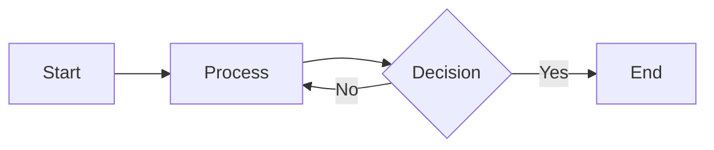

**Code:**
```
graph LR
    A[Start] --> B[Process]
    B --> C{Decision}
    C -->|Yes| D[End]
    C -->|No| B
```

---

## 📊 Common Diagram Types

### Flowchart / Process Diagram

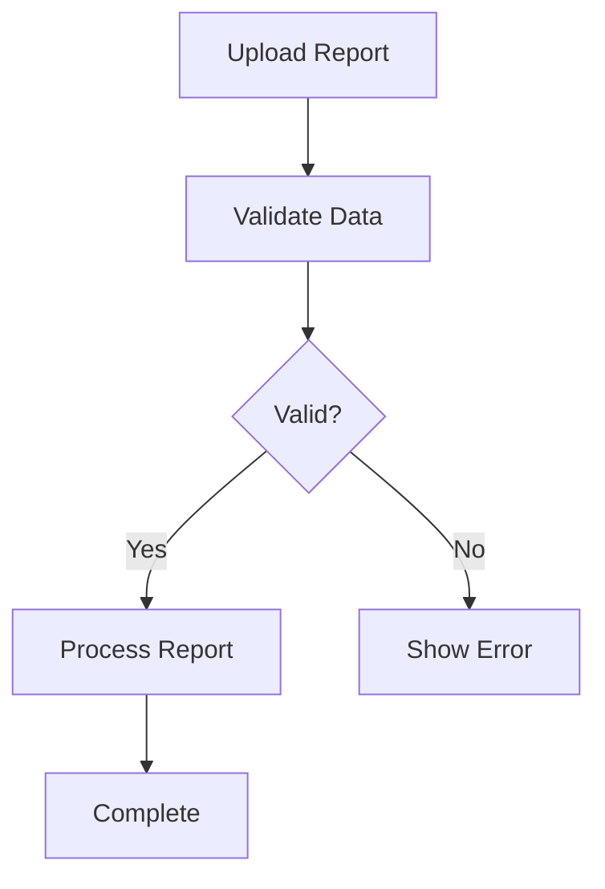

**Syntax:**
- `graph TB` or `flowchart TB` (TB = Top to Bottom)
- `LR` = Left to Right, `RL` = Right to Left, `BT` = Bottom to Top
- `[Text]` = Rectangle, `{Text}` = Diamond, `([Text])` = Stadium

---

### Sequence Diagram

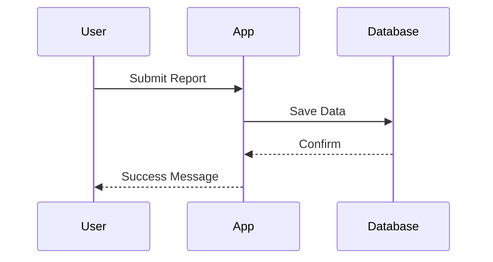

**Code:**
```
sequenceDiagram
    participant User
    participant App
    participant Database
    
    User->>App: Submit Report
    App->>Database: Save Data
    Database-->>App: Confirm
    App-->>User: Success Message
```

---

### State Diagram

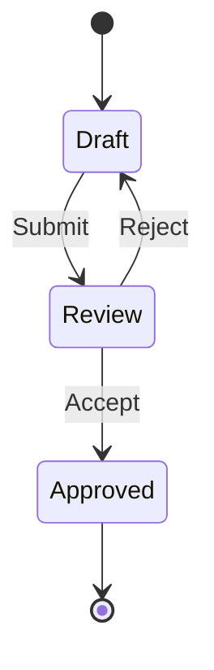

---

### Entity Relationship Diagram

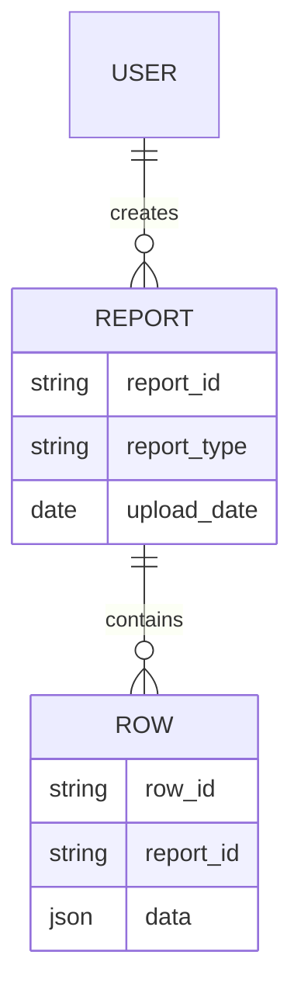

---

## 🎨 Styling & Formatting

### Add Colors

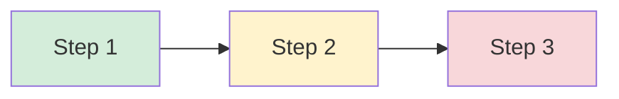

**Code:**
```
style A fill:#d4edda
style B fill:#fff3cd
style C fill:#f8d7da
```

---

### Subgraphs (Group Components)

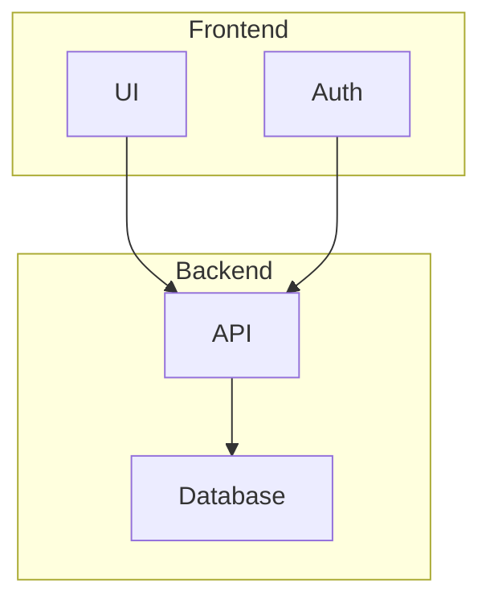

---

### Arrow Types

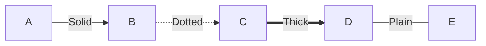

**Code:**
```
A -->|Label| B    (Solid arrow with label)
B -.->|Label| C   (Dotted arrow)
C ==>|Label| D    (Thick arrow)
D ---|Label| E    (Plain line)
```

---

## 🛠️ Creating Your Own Diagrams

### Step 1: Write the Code

In any markdown file, create a code fence with `mermaid`:

\```mermaid
graph LR
    A[Your Node] --> B[Another Node]
\```

### Step 2: Test Online

Use the **Mermaid Live Editor** to preview and test:
👉 https://mermaid.live/

### Step 3: Add to Repository

Paste your Mermaid code into any `.md` file in your repository. GitHub will automatically render it!

---

## 📝 Examples for OCSS Command Center

### System Overview

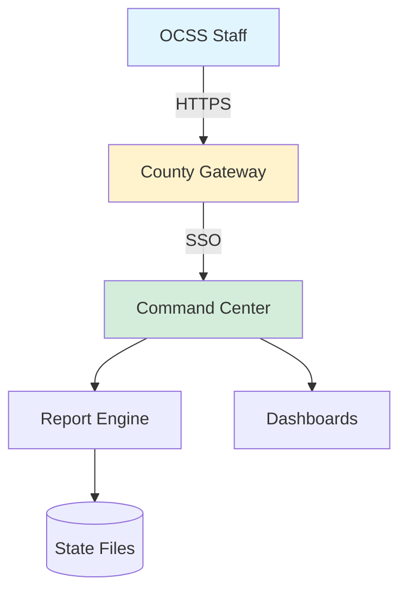

### Authentication Flow

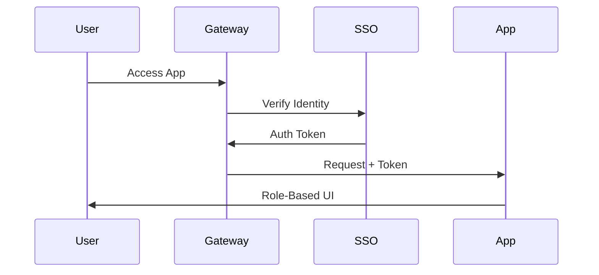

### Deployment Architecture

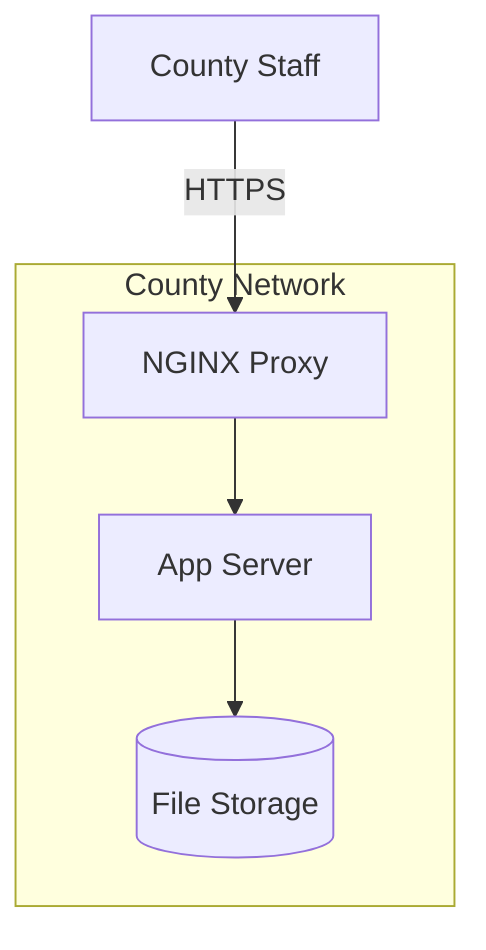

---

## 💡 Tips & Tricks

1. **Start Simple** - Begin with basic flowcharts, add complexity gradually
2. **Use Live Editor** - Test at mermaid.live before committing
3. **Check Syntax** - One wrong character can break rendering
4. **Add Comments** - Use `%%` for comments: `%% This is a comment`
5. **Preview Locally** - Install "Markdown Preview Mermaid Support" VS Code extension

---

## 🔗 Resources

- **Official Docs:** https://mermaid.js.org/
- **Live Editor:** https://mermaid.live/
- **Syntax Guide:** https://mermaid.js.org/intro/syntax-reference.html
- **Examples:** https://mermaid.js.org/ecosystem/integrations.html

---

## ✅ Advantages for IT Documentation

| Feature | Mermaid | PNG/JPG Images |
|---------|---------|---------------|
| Version Control | ✅ Text-based diffs | ❌ Binary files |
| Easy Updates | ✅ Edit text | ❌ Recreate image |
| GitHub Rendering | ✅ Automatic | ⚠️ Upload required |
| Accessibility | ✅ Screen reader friendly | ❌ Alt text only |
| File Size | ✅ Small (text) | ⚠️ Large (images) |
| Collaboration | ✅ Easy to review | ❌ Hard to review |

---

**Ready to create diagrams?**  
See [mermaid_diagrams.md](./mermaid_diagrams.md) for complete OCSS Command Center examples!
