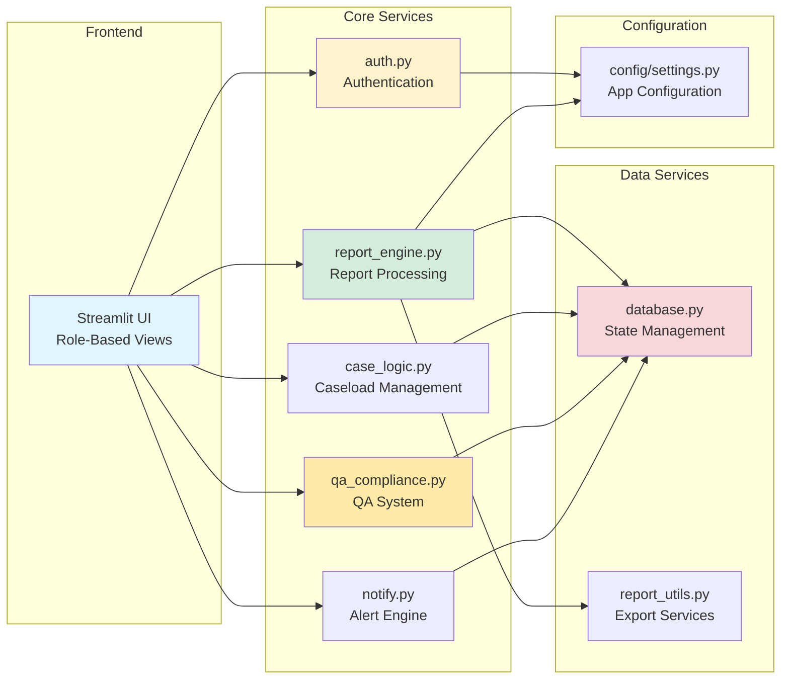
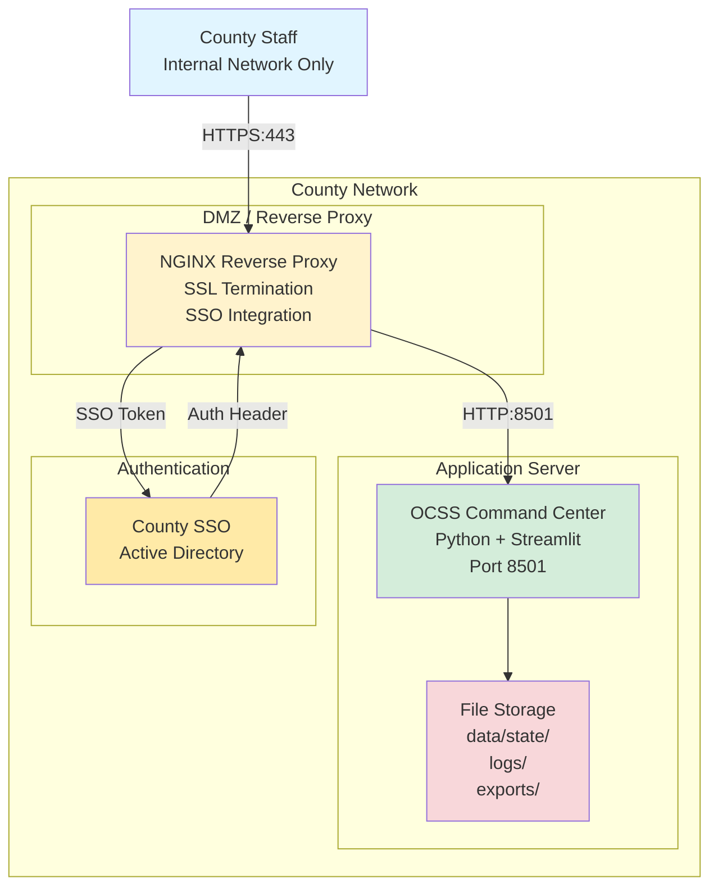
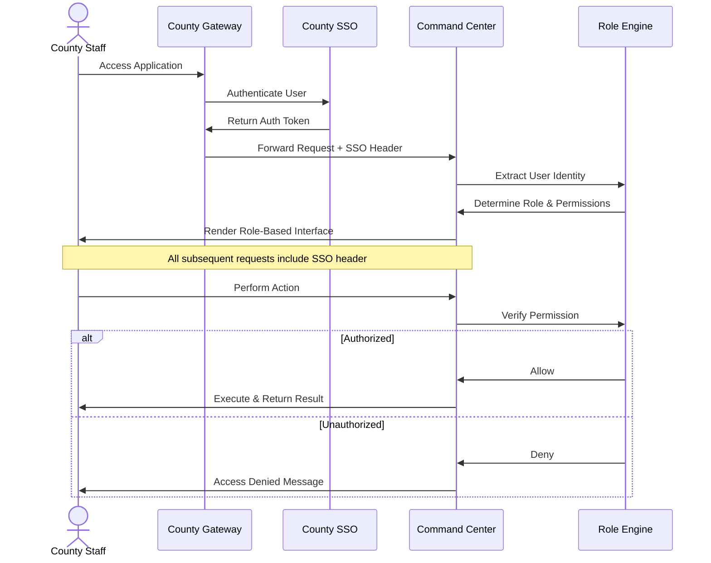
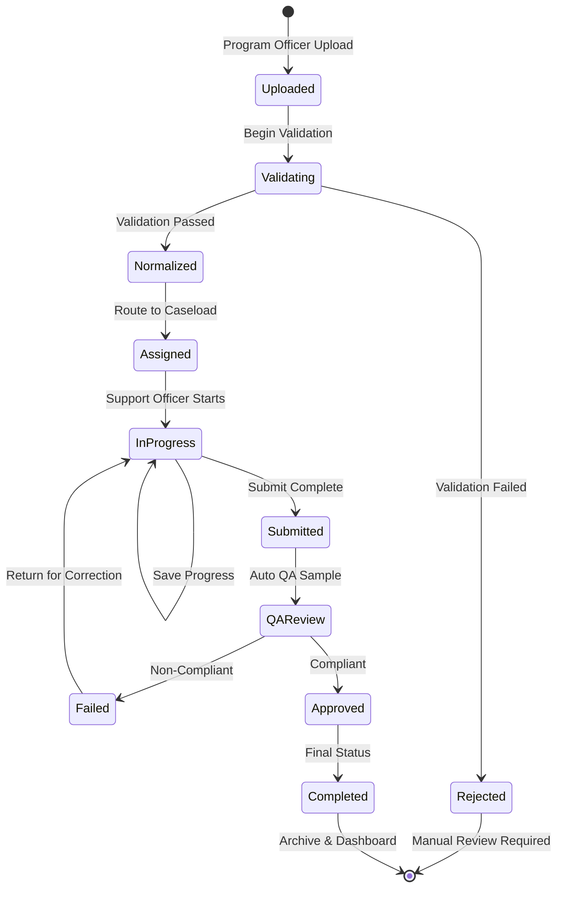
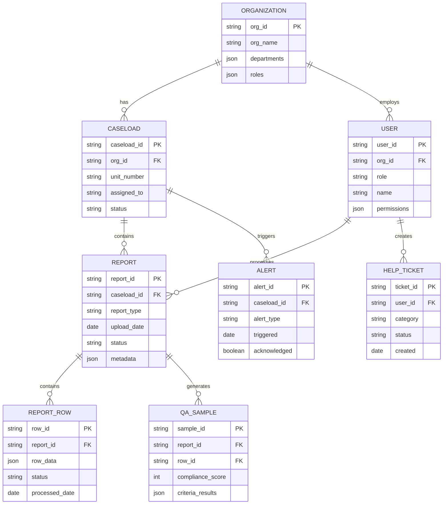

# OCSS Command Center - Mermaid Diagram Examples

**Version:** 1.0  
**Last Updated:** March 9, 2026

This document demonstrates how to create visual diagrams using Mermaid syntax that renders directly in GitHub.

---

## System Architecture Diagram

```mermaid
graph TB
    subgraph "User Layer"
        Users[OCSS Users<br/>Director | Program Officers<br/>Supervisors | Support Officers]
    end
    
    subgraph "Network Layer"
        Gateway[County Gateway / NGINX<br/>SSL/TLS | SSO | Security]
    end
    
    subgraph "Application Layer"
        App[OCSS Command Center<br/>Python + Streamlit]
        Auth[Authentication<br/>& RBAC]
        Reports[Report Engine<br/>Pandas]
        Dashboards[KPI Dashboards<br/>& Analytics]
        QA[QA & Compliance<br/>Engine]
        Tickets[Help Ticket<br/>Center]
    end
    
    subgraph "Data Layer"
        State[(Application State<br/>JSON Files)]
        Exports[Export Services<br/>Excel | Word | CSV]
    end
    
    subgraph "External Systems"
        SETS[SETS<br/>Child Support System]
        OnBase[Hyland OnBase<br/>Document Management]
        ODJFS[ODJFS<br/>Reporting Infrastructure]
    end
    
    Users -->|HTTPS| Gateway
    Gateway -->|Authenticated| App
    App --> Auth
    App --> Reports
    App --> Dashboards
    App --> QA
    App --> Tickets
    Reports --> State
    App --> Exports
    App -.->|Read Only| SETS
    App -.->|Read Only| OnBase
    App -.->|Report Source| ODJFS
    
    style Users fill:#e1f5ff
    style Gateway fill:#fff3cd
    style App fill:#d4edda
    style State fill:#f8d7da
    style SETS fill:#e2e3e5
    style OnBase fill:#e2e3e5
    style ODJFS fill:#e2e3e5
```

---

## Data Flow Diagram

```mermaid
flowchart TD
    Start[ODJFS Operational Reports<br/>56RA | P-S | Locate] --> Upload[Program Officer<br/>Upload & Metadata]
    
    Upload --> Ingest[Report Ingestion<br/>Validation | Deduplication]
    
    Ingest --> Normalize[Normalization Engine<br/>Pandas Processing]
    
    Normalize --> Route{Route to<br/>Caseload}
    
    Route --> C1[Downtown Establishment<br/>Caseload 181000]
    Route --> C2[Midtown Enforcement<br/>Caseload 181001]
    Route --> C3[Uptown Collections<br/>Caseload 181002]
    
    C1 --> Alerts[Alert Engine<br/>Due Soon | Overdue]
    C2 --> Alerts
    C3 --> Alerts
    
    C1 --> Process[Support Officer<br/>Row Processing]
    C2 --> Process
    C3 --> Process
    
    Process --> QA[QA Validation<br/>Compliance Check]
    
    QA --> Complete{Complete &<br/>Compliant?}
    
    Complete -->|No| Process
    Complete -->|Yes| Dashboard[Leadership Dashboards<br/>KPIs | Metrics]
    
    Dashboard --> Export[Export Services<br/>Excel | Word | CSV]
    
    Complete -->|Yes| SOR[Systems of Record<br/>SETS | OnBase]
    
    style Start fill:#e1f5ff
    style Normalize fill:#d4edda
    style Alerts fill:#fff3cd
    style QA fill:#ffeaa7
    style Dashboard fill:#d4edda
    style SOR fill:#e2e3e5
```

---

## Architecture Component Diagram



---

## Deployment Topology Diagram



---

## Authentication Flow Diagram



---

## Report Processing State Machine



---

## Entity Relationship Diagram



---

## How to Use Mermaid Diagrams

### Syntax in Markdown

Simply wrap your Mermaid code in a code fence with `mermaid` language identifier:

\```mermaid
graph LR
    A[Start] --> B[Process]
    B --> C[End]
\```

### Supported Diagram Types

1. **Flowchart** - `graph` or `flowchart`
2. **Sequence Diagram** - `sequenceDiagram`
3. **State Diagram** - `stateDiagram-v2`
4. **Entity Relationship** - `erDiagram`
5. **Gantt Chart** - `gantt`
6. **Pie Chart** - `pie`
7. **Class Diagram** - `classDiagram`

### Styling Tips

- Use `subgraph` to group related components
- Apply styles: `style NodeName fill:#color`
- Use arrow types: `-->` (solid), `-.->` (dotted), `==>` (thick)
- Add notes: `Note over A,B: Description`

### GitHub Rendering

✅ Mermaid diagrams render automatically in GitHub markdown files  
✅ No plugins or extensions required  
✅ Version controlled as text  
✅ Easy to update and maintain

---

## Additional Resources

- **Mermaid Documentation:** https://mermaid.js.org/
- **Live Editor:** https://mermaid.live/
- **VS Code Extension:** Mermaid Preview

---

**For IT Review:**
These diagrams are embedded directly in the architecture documentation and render automatically in GitHub. No separate image files needed!
